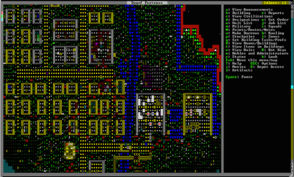

# JSON Spring

## Description

Turn the IronGram project we made in class into a SnapChat-like service by making it delete the photos briefly after they are first viewed.

## Requirements

* Delete photos from the database and the disk if they were viewed by the `/photos` route 10 or more seconds ago. This requirement is open-ended -- you need to figure out how to do it.
* Create an input box in the upload form to let the user specify how many seconds they want the photo to exist. Store the number in the `Photo` entity. Then use that number instead of 10 seconds in your deletion code.
* Add a recipient field to the upload form. If it's not blank, make it so only that user can see the photo.
